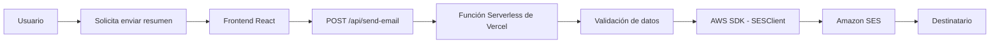

# ✅ TODO APP

Aplicación web para la gestión de tareas (TODOs) desarrollada con **React**, **TypeScript** y **Vite**. Permite administrar tareas de forma intuitiva, incorpora autenticación mediante Firebase y ofrece la posibilidad de enviar un resumen de las tareas por correo electrónico utilizando **Amazon Simple Email Service (AWS SES)**.

El proyecto fue desarrollado aplicando una arquitectura modular orientada a funcionalidades, con el objetivo de lograr un código escalable, reutilizable y fácil de mantener.

---

# 🚀 Tecnologías

- React 19
- TypeScript
- Vite
- React Router DOM
- Firebase
- Amazon SES (AWS SDK)
- Vercel Serverless Functions
- ESLint
- Vitest
- Testing Library

---

# ✨ Características

- Gestión de tareas.
- Autenticación de usuarios mediante Firebase.
- Protección de rutas privadas.
- Cambio entre tema claro y oscuro.
- Componentes reutilizables.
- Hooks personalizados.
- Envío de resumen de tareas por correo electrónico.
- Testing de componentes.

---

# 🏛 Arquitectura

El proyecto sigue una **arquitectura modular basada en funcionalidades (Feature-Based Architecture)**, donde cada módulo agrupa los elementos relacionados con una misma responsabilidad.

Esta organización facilita el mantenimiento, mejora la reutilización del código y permite incorporar nuevas funcionalidades sin afectar el resto de la aplicación.

---

# 📱 Diseño

La interfaz fue desarrollada siguiendo un enfoque **Mobile First**, priorizando la experiencia de uso en dispositivos móviles desde las primeras etapas del desarrollo. A partir de una base optimizada para pantallas pequeñas, se incorporaron **media queries** para adaptar la disposición de los elementos a tablets y equipos de escritorio.

Este enfoque permitió construir una interfaz responsive, manteniendo una experiencia consistente en distintos tamaños de pantalla.

### Características del diseño

- Diseño **Mobile First** como punto de partida.
- Interfaz **responsive** adaptada a dispositivos móviles, tablets y escritorio.
- Uso de **Flexbox** para la distribución de los componentes.
- Componentes reutilizables con estilos consistentes.
- Navegación optimizada para distintos tamaños de pantalla.
- Cambio entre **tema claro y oscuro**, mejorando la accesibilidad y la experiencia del usuario.

---

# 📁 Organización del proyecto

```text
TODO-APP_GastonStratta
│
├── api/                    # Funciones Serverless de Vercel
│
├── public/
│
├── src/
│   ├── assets/
│   ├── components/
│   ├── features/
│   ├── hooks/
│   ├── pages/
│   ├── services/
│   ├── test/
│   ├── types/
│   ├── utils/
│   ├── App.tsx
│   ├── main.tsx
│   └── index.css
│
├── .env.example
├── package.json
└── README.md
```

## Descripción de las carpetas

| Carpeta | Responsabilidad |
|----------|-----------------|
| **api** | Funciones Serverless utilizadas para el envío de emails mediante AWS SES. |
| **assets** | Recursos estáticos como imágenes, iconos y estilos. |
| **components** | Componentes reutilizables de la interfaz (TaskList, Navbar, ThemeToggle, etc.). |
| **features** | Organización por funcionalidades de negocio, como autenticación y manejo del tema. |
| **hooks** | Hooks personalizados para reutilizar lógica entre componentes. |
| **pages** | Páginas principales de la aplicación. |
| **services** | Comunicación con Firebase y servicios externos. |
| **test** | Pruebas unitarias utilizando Vitest y Testing Library. |
| **types** | Interfaces y tipos de TypeScript compartidos. |
| **utils** | Funciones auxiliares reutilizables. |

---

# 🧠 Decisiones arquitectónicas

Durante el desarrollo del proyecto se tomaron las siguientes decisiones:

- Utilizar **TypeScript** para obtener tipado estático y reducir errores durante el desarrollo.
- Organizar la aplicación mediante una arquitectura **Feature-Based**, agrupando funcionalidades relacionadas.
- Separar la lógica de negocio de la interfaz mediante servicios y hooks personalizados.
- Centralizar la comunicación con servicios externos dentro de la carpeta `services`.
- Implementar componentes reutilizables para evitar duplicación de código.
- Utilizar funciones Serverless de Vercel para encapsular el envío de emails.
- Mantener las credenciales de AWS exclusivamente del lado del servidor mediante variables de entorno.
- Incorporar testing automatizado para validar el funcionamiento de componentes críticos.

---

# 📧 Flujo de envío de emails

La aplicación permite enviar un resumen de las tareas utilizando Amazon SES.

El flujo de funcionamiento es el siguiente:



## Funcionamiento

1. El usuario solicita enviar el resumen.
2. El frontend realiza una petición **POST** al endpoint `/api/send-email`.
3. La función Serverless valida la información recibida.
4. Se crea un `SendEmailCommand` utilizando el SDK oficial de AWS.
5. Amazon SES procesa la solicitud.
6. El correo es enviado al destinatario configurado.
7. La API responde con el identificador del mensaje o un error si el envío falla.

---

# 🔐 Variables de entorno

Para ejecutar correctamente la aplicación es necesario crear un archivo `.env` a partir de `.env.example`.

Las variables requeridas son:

| Variable | Descripción |
|----------|-------------|
| `VITE_FIREBASE_API_KEY` | API Key de Firebase |
| `VITE_FIREBASE_AUTH_DOMAIN` | Dominio de autenticación |
| `VITE_FIREBASE_PROJECT_ID` | ID del proyecto |
| `VITE_FIREBASE_STORAGE_BUCKET` | Bucket de almacenamiento |
| `VITE_FIREBASE_MESSAGING_SENDER_ID` | Sender ID |
| `VITE_FIREBASE_APP_ID` | ID de la aplicación Firebase |
| `AWS_REGION` | Región configurada en Amazon SES |
| `AWS_ACCESS_KEY_ID` | Access Key de AWS |
| `AWS_SECRET_ACCESS_KEY` | Secret Access Key de AWS |
| `SES_FROM_EMAIL` | Dirección de correo verificada en Amazon SES |

---

# ⚙ Instalación

## Clonar el repositorio

```bash
git clone https://github.com/tongax12/TODO-APP_GastonStratta.git
```

## Ingresar al proyecto

```bash
cd TODO-APP_GastonStratta
```

## Instalar dependencias

```bash
npm install
```

## Configurar variables de entorno

Crear un archivo `.env` utilizando como referencia `.env.example`.

## Ejecutar el proyecto

```bash
npm run dev
```

---

# 📦 Scripts disponibles

| Script | Descripción |
|---------|-------------|
| `npm run dev` | Ejecuta la aplicación en modo desarrollo. |
| `npm run build` | Genera la versión de producción. |
| `npm run preview` | Ejecuta una vista previa de la versión compilada. |
| `npm run lint` | Analiza el código con ESLint. |
| `npm run test` | Ejecuta los tests. |
| `npm run test:watch` | Ejecuta los tests en modo observación. |

---

# 🧪 Testing

El proyecto incorpora pruebas utilizando:

- Vitest
- React Testing Library
- Jest DOM

Las pruebas permiten verificar el correcto funcionamiento de componentes y funcionalidades críticas.

---

# 🌐 URL de producción

Todavía no lo deeployee


# 📝 Convención de commits

Durante el desarrollo se utilizaron **Conventional Commits**.

Ejemplos:

```text
feat:

fix:

docs: 

test: 
```

---


# 🤖 Uso de Inteligencia Artificial

Durante el desarrollo del proyecto se utilizaron herramientas de Inteligencia Artificial como apoyo para tareas de documentación, resolución de dudas técnicas y revisión de código.

El detalle del uso de estas herramientas puede consultarse en el archivo [UsoDeIA.md](./UsoDeIA.md).

---

# 👨‍💻 Autor

**Gastón Stratta**

Proyecto desarrollado como práctica de desarrollo Frontend aplicando React, TypeScript, Firebase y AWS SES.